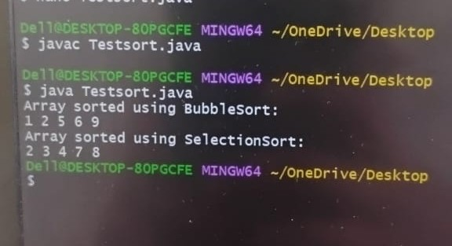

# EXPERIMENT-5
## TITLE:5a)java program to implement interface
```
// Interface definition
interface Sortable {
    void sort(int[] arr);
}

// BubbleSort class implementing Sortable
class BubbleSort implements Sortable {
    public void sort(int[] arr) {
        int n = arr.length;
        for (int i = 0; i < n - 1; i++) {
            for (int j = 0; j < n - i - 1; j++) {
                if (arr[j] > arr[j + 1]) {
                    // swap
                    int temp = arr[j];
                    arr[j] = arr[j + 1];
                    arr[j + 1] = temp;
                }
            }
        }
    }
}

// SelectionSort class implementing Sortable
class SelectionSort implements Sortable {
    public void sort(int[] arr) {
        int n = arr.length;
        for (int i = 0; i < n - 1; i++) {
            int minIndex = i;
            for (int j = i + 1; j < n; j++) {
                if (arr[j] < arr[minIndex]) {
                    minIndex = j;
                }
            }
            // swap
            int temp = arr[i];
            arr[i] = arr[minIndex];
            arr[minIndex] = temp;
        }
    }
}

// Main class to test sorting
public class TestSort {
    // Method to display array
    static void printArray(int[] arr) {
        for (int num : arr) {
            System.out.print(num + " ");
        }
        System.out.println();
    }

    public static void main(String[] args) {
        // First array for BubbleSort
        int[] arr1 = {5, 2, 9, 1, 6};
        Sortable ref;

        ref = new BubbleSort();
        ref.sort(arr1);
        System.out.println("Array sorted using BubbleSort:");
        printArray(arr1);

        // Second array for SelectionSort
        int[] arr2 = {8, 3, 7, 4, 2};
        ref = new SelectionSort();
        ref.sort(arr2);
        System.out.println("Array sorted using SelectionSort:");
        printArray(arr2);
    }
}
```
# OUTPUT

